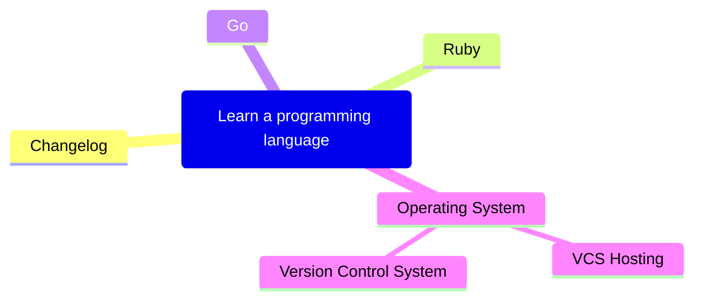
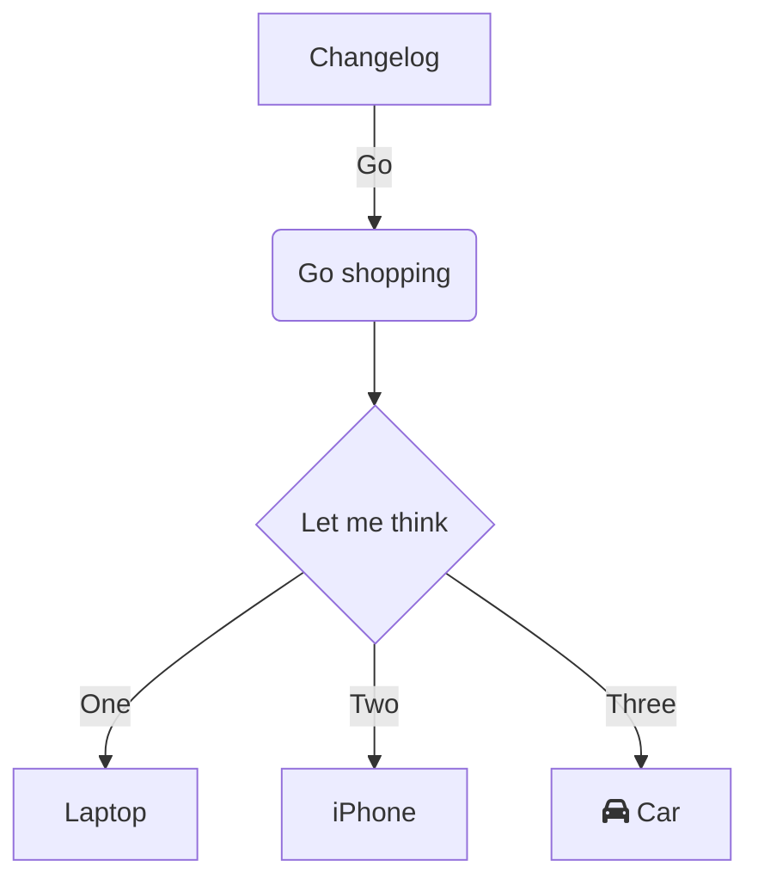
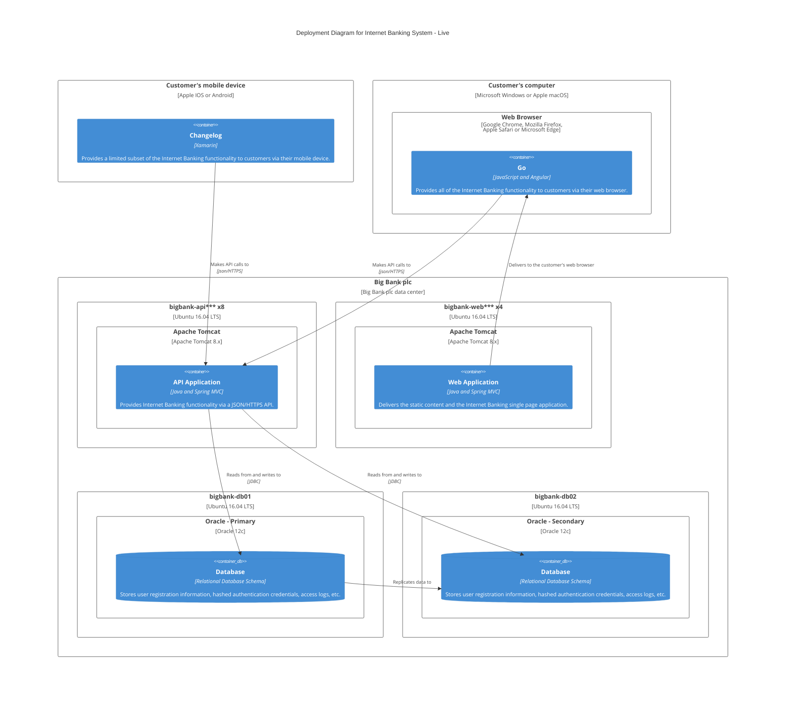
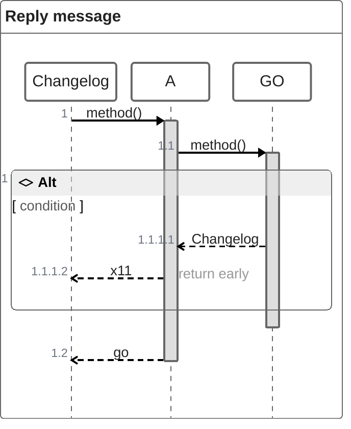
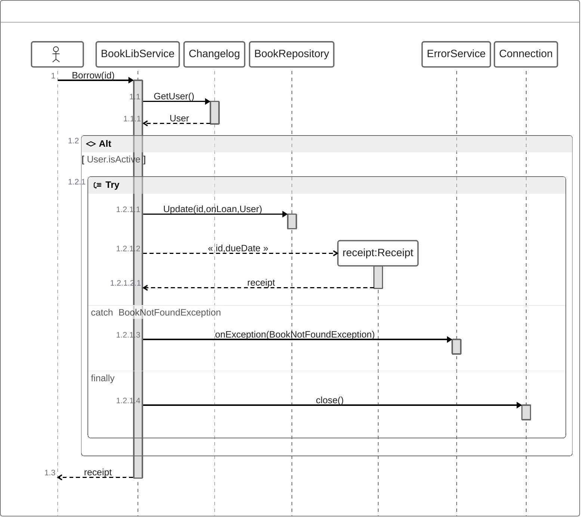

## Mindmap

## Flowchart

## C4Context

## ZenUML

<!-- hidding this twitter for now since twitter account is having issues.

 

-->

This section is a high-level overview of how the Compage Documentation is structured. It will help you use the documentation more effectively by guiding you on where to look for specific information.

The Compage Documentation covers everything you need to know about Compage. It made up of four main sections which are:

- [Getting started](../3-installation)
- [Contributing](../6-contribution)
- [User Guide](../5-guides)
- [FAQs](../8-faq)

## Introduction

In the `introduction` section, you will find the three pages below. Head over to the `Installation` page to get the Compage up and running on your KinD cluster.
The `What is Compage?` page summarizes the goals and features of the Compage project.

- [What is Compage?](../2-overview)
- [Community](../4-community)
- [Installation](../3-installation)

## Contributing

Compage is written in `Golang`, `NodeJS` and `ReactJS` and is `Apache License` - contributions are always welcome whether that means providing feedback, be it through GitHub, through the `#feedback` channel on our [Discord server](https://discord.gg/DeapQc22qe) or testing existing and new features. All the relevant information below:

- [Contribute](../6-contribution)

## Guides

We want to be able to give Compage users the tips and guidance necessary to be able to get the most value from the tool as quickly as possible. That's why we will be continuously adding and updating informative guides and series in which try to relay valuable and actionable advice.

- [How to use Compage](../5-guides)

## FAQs

Find all the answers to all the Compage related questions you might have. Feel free to reach out via the `#feedback` channel on [Discord](https://discord.gg/DeapQc22qe) to request the inclusion of additional questions.

- [FAQs](../8-faq)
