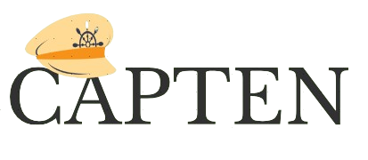

Welcome to the capten Documentation! This guide is designed to provide you with comprehensive insights into capten and its functionalities, enabling you to effectively navigate through its features. The documentation is structured into five main sections:

### Overview

[Overview](../2-overview/_index.en.md): Discover a comprehensive overview of the capten project,where automates the cluster creation,destruction and deploying the application. Explore how capten transforms complexities into ease, offering a suite of user-friendly features crafted to enhance and simplify your tasks.

###  Installation of Capten 

#### Capten Controlplane Cluster
[Getting started](../3-setup/installation/_index.en.md): The starting point to set up capten for bringing up your cluster. Follow the instructions here to use capten efficiently.

#### Capten UI
[Capten UI](../3-setup/capten-ui/_index.en.md): The starting point to connect with capten UI for registering the cluster in capten UI.

#### Capten SDK

[Capten-SDK](../3-setup/capten-sdk/_index.en.md): Follow the instructions mentioned here to develop and deploy applications on capten cluster

#### Capten Crossplane Plugin

[Capten-CrossPlane-Plugin](../3-setup/capten-crossplane/_index.en.md):Follow the steps mentioned here  to configure business cluster

#### Capten Tekton Plugin

[Capten-Tekton](../3-setup/capten-tekton/_index.en.md):Follow the steps given here to configure tekton and to create CI/CD pipelines

#### Capten ArgoCD Plugin

[Capten-ArgoCD](../3-setup/capten-argocd/_index.en.md):Follow the steps given here to deploy argocd and to know how argocd plays an important role in capten

### Usecase

[Usecase](../5-usecase/_index.en.md): This section explains the powerful capabilities designed to streamline your Kubernetes and DevSecOps workflows. Discover how capten simplifies complex tracking tasks across various crucial aspects of your infrastructure.

### Contribution

[Contributing](../6-contribution/_index.en.md): Capten, developed using Golang under the Apache License, enthusiastically invites contributions from individuals like you. Your input is invaluable, whether it's providing feedback on GitHub or actively participating in feature testing. Your involvement greatly enriches the capten community and development efforts.

### FAQs

[FAQs](../7-faq/_index.en.md) : Have questions about capten? Check out our FAQ section, where we aim to address common queries. Your suggestions for additional questions are always welcome. Find answers to frequently asked questions about Capten.

