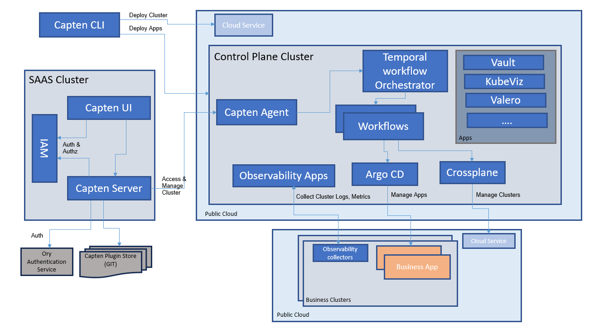

**Capten** is the `open-source` project by Intelops.

Capten streamlines the management of Kubernetes clusters, making it an ideal solution for teams or individuals who require automated cluster provisioning, application deployment, and lifecycle management in their development and testing workflows.

The all-in-one DevSecOps platform facilitates close collaboration to build and manage cloud-native ecosystems for application and infrastructure modernization, automation, and security.

## Problem

1. Manual Cluster Setup Complexity
2. Limited Visibility and Monitoring
3. Lack of Cluster Destruction Automation
4. Security Risks
5. Inefficiency in Development and Testing
6. Disconnect Between Dev, Sec, Ops & SRE

## Solution

Capten is a platform that makes it easy for teams to work together on software projects without sacrificing speed or security. It helps manage tasks like setting up servers and coordinating efforts between different team members. This means less room for mistakes and more time to focus on actually building and improving software.

### How Capten solves the problem:

1. Protect your cloud-native applications and infrastructure from threats and vulnerabilities
2. Automated Cluster Setup and destruction
3. Brings up the industry-best open-source tools to enhance your cloud-native ecosystem to always keep you up-to-date.
4. Distributed Tracing for efficient debugging and performance using openTelemetry (OTL).
5. GitOps principles for consistent and secure Continuous Delivery & Continous Deployments.
6. Backup and recovery capabilities to safeguard your control cluster(s) data and applications.
7. Kubernetes native tool kits streamlined CI pipelines, enabling automated and efficient software delivery.
8. Automated secure software supply chain measures.

