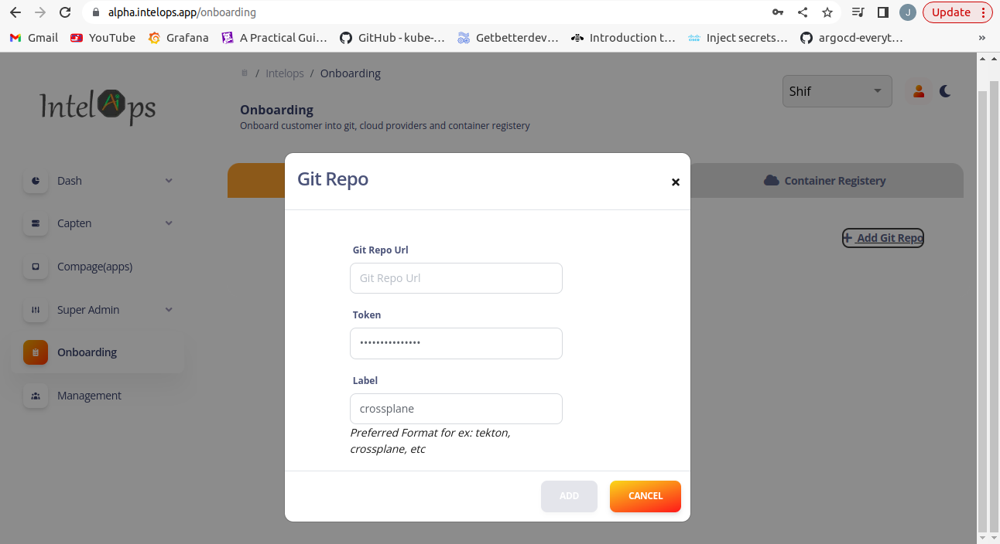
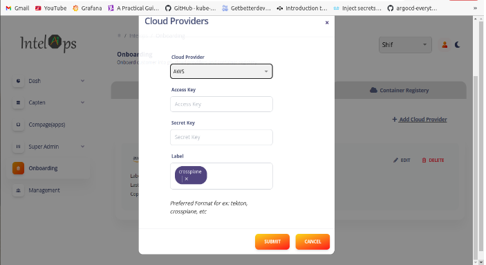
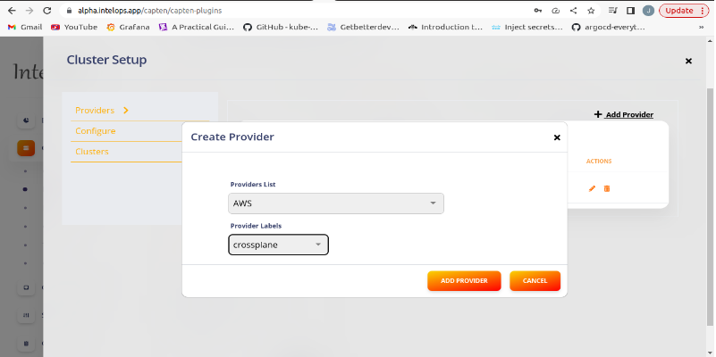
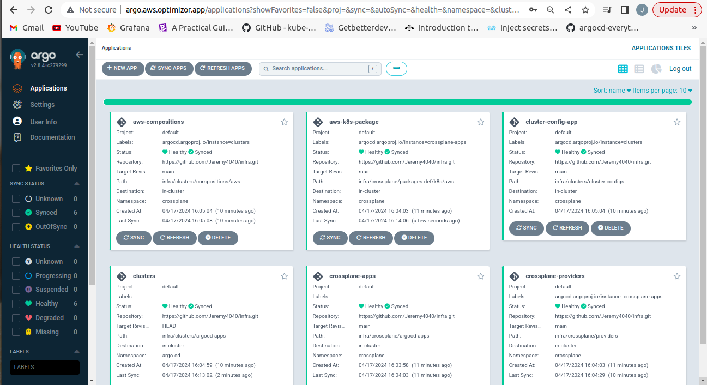
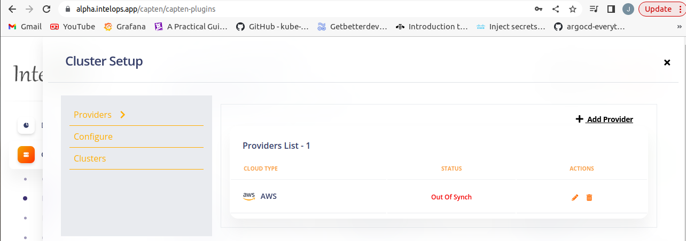

This document covers about how to set up crossplane and configure Business cluster on your machine.

# Capten Crossplane Plugin

## Onboard cluster resources:

### Git Project:

1. First to add crossplane plugin, we need to add an empty private repository.
2. In onboarding section, go to **Git** tab and click _Add Git Repo_.
3. Enter the git repo url and the token and also set the label to crossplane.

=======
Add git repository details in the mentioned section_

### Cloud Provider:

1. Now to add cloud provider, go to **Cloud Providers** and click _ Add Cloud Provider_.
2. Select the required cloud provider and enter the credentials for the same. (The label is set to crossplane)

Add cloud provider details in the mentioned section_

**Note:** The label _crossplane_ is used by the crossplane plugin to reference both the repository and provider.

## Create Crossplane provider:

1. In platform engineering section, select _Setup_ under **Crossplane** plugin.
2. Under providers section, select both the required provider and 'crossplane' label.
3. Under configure section, click sync next to the repository which is needed to deploy the plugin.
4. After the sync, the provider will get deployed and enter _Healthy_ state in a few minutes.

Once onboarding is done both the git and provider details will be automatically populated in crossplane plugin using crossplane label_

## Create Business cluster

1. After the sync is successful, the crossplane objects and its argocd applications are added to the empty repository under the infra directory.
2. Go to infra/clusters/cluster-configs/cluster-claim.yaml
3. Uncomment the cluster-claim.yaml file (or add any required changes)
4. Go to argocd UI page and sync all crossplane related applications
5. After the clusterclaim is created, the business cluster creation will get triggered.

Make sure to sync all crossplane related apps_

## Delete Business cluster

1. To delete the business cluster, remove all applications from the business cluster.
2. Go to infra/clusters/cluster-configs and remove cluster-claim.yaml
3. Now prune sync the cluster-config-app application (watching the cluster-claim.yaml).
4. This will trigger the business cluster deletion

## Delete Crossplane provider

1. To delete crossplane provider, go to capten UI.
2. Under platform engineering, select _Setup_ under **Crossplane** plugin
3. Under providers section, select the delete option next to the provider which is to be deleted.
4. This removes the provider from the cluster
5. It is also possible to remove the provider from onboarding list by the delete option provided with the cloud provider

To delete the crossplane provider, click the delete button next to the provider name