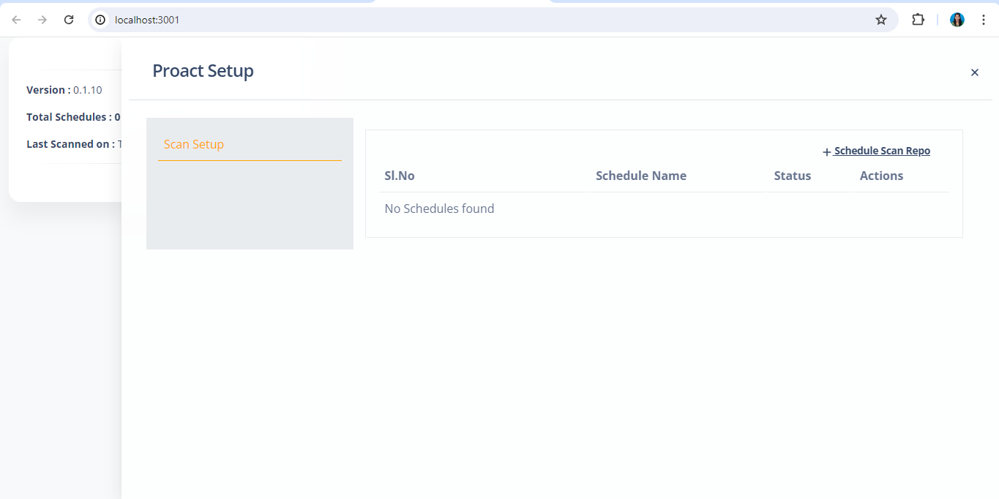
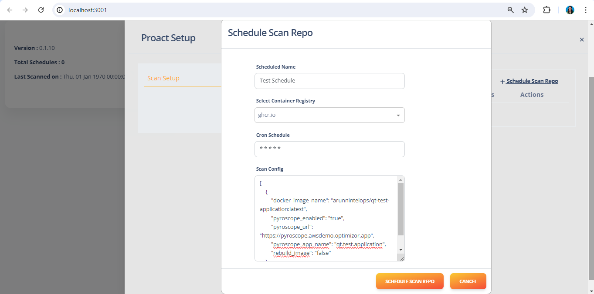
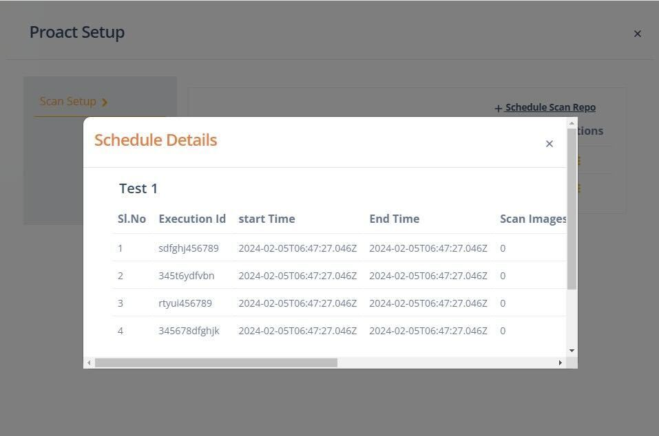

This document covers about how to set up and configure proact in capten

# What is Proact and how to use it?

Proact is CLI/CI Tool for Automating Vulnerability Management for Enhancing Software Supply Chain Security Measures.

After selecting proact from the installed apps, you will be treated with a list of schedules, if there are any. To create a new schedule click on Schedule Scan repo.



Fill all the details for the schedule and config

| Attribute   | Description                           |
| ----------- | ------------------------------------- |
| Schedule Name  | Name of the schedule               |
| Select Container Registry | Select the container registry        |
| Cron Schedule    | Schedule for the job in crontab expression           |
| Scan Config        | Config details for the job             |


proact-schedule-details

<b>sample config</b>
```json
[
    {
        "docker_image_name": "arunnintelops/qt-test-application:latest", // Docker image name
        "pyroscope_enabled": "true", // To enable pyroscope
        "pyroscope_url": "https://pyroscope.awsdemo.optimizor.app", //Url for pyroscope
        "pyroscope_app_name": "qt.test.application", //Application name in pyroscope
        "rebuild_image": "false" //Option to enable or disable rebuild image after scanning
    }
]
```
Afet successful scan you can view the result of the scan.

proact-schedule-results


