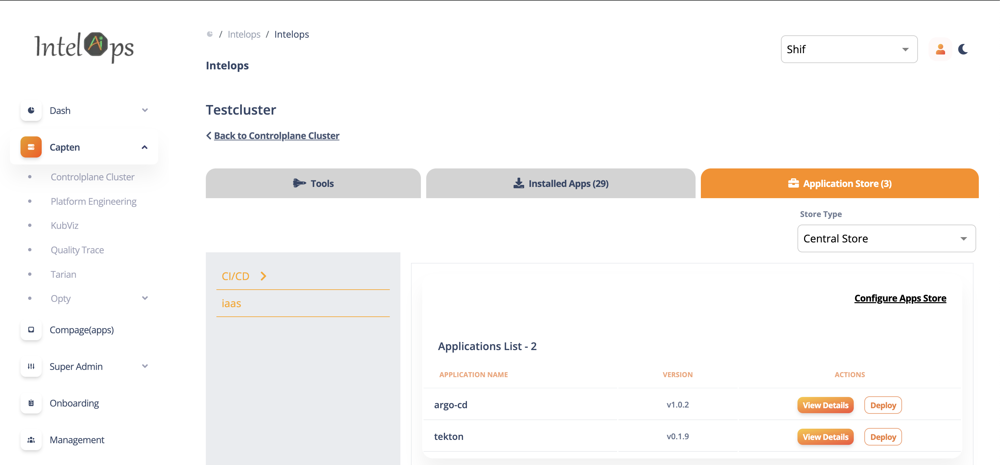
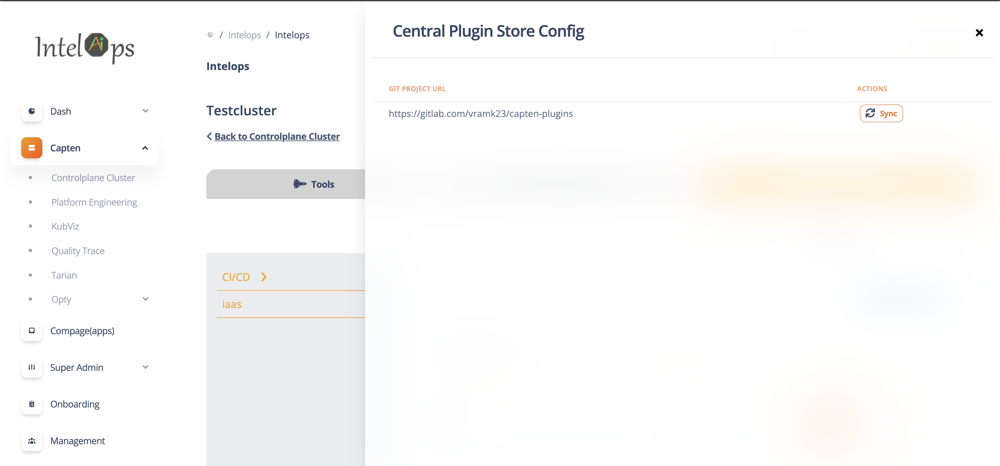
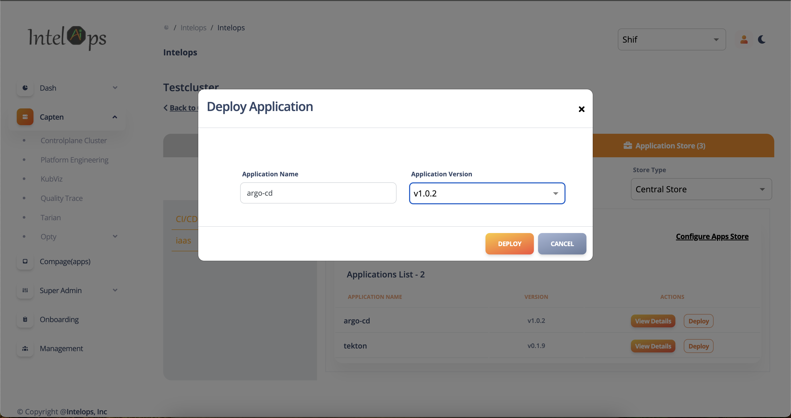
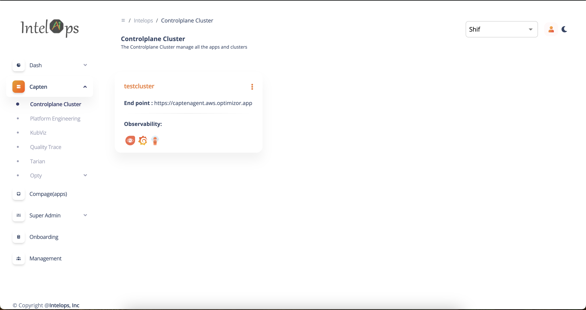
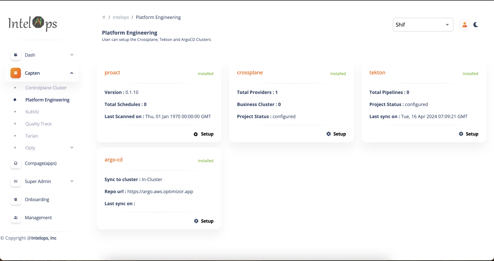

This document covers about  Capten SDK to develop and deploy applications on capten cluster.
# Capten Plugin SDK

## Features

- Onboard Plugin applications in to Capten Plugin Store
- Deploy Plugin applications on Capten cluster
- Deploy Plugin applications on Business cluster
- Capten Cluster Storage service access for Plugin application
- Capten Cluster Vault service access for Plugin application
- Capten Cluster SDK API service access for Plugin application
- Enabling Single SignOn for Plugin application UI

## Capten Plugin Store

Capten SDK provides a simple way to onboard the Capten Plugin Applications (Plugins or Plugin Apps) into the Capten Plugin Store.

### Central Plugin Store

Our Team manages the central plugin store in the Git repository (https://github.com/intelops/capten-plugin) to onboard and manage Capten Plugin applications. This is an open-source repository for the Capten community to onboard and manage Capten Plugin applications.

This Central Plugin Store is integrated with Capten Stack by default, and Plugins available in the Central Plugin Store can be deployed on the Capten cluster from the Capten UI.

### Local Plugin Store

Capten SDK supports managing a local plugin store, i.e., in your Git repository. A Git repository needs to be integrated into the Capten from Capten UI, which can then be used to onboard and manage Plugin applications.

## Onboarding Plugin Application

Pre-requisites to onboard Plugin Application into this Capten Plugin Store

### Prerequisites

- Plugin Application available in helm repository accessible from Capten cluster
- Container image for plugin application available in container registry onboarded into the Capten cluster

### Add Plugin Application name

Add the plugin application name in `plugin-store/plugin-list.yaml` file

```
plugins:
  - argo-cd
  - crossplane
  - tekton
```

### Add Plugin Application Configuration

Create a folder with plugin name `plugin-store/<plugin-name>`, and add plugin metadata files

- Add plugin application configuration in `plugin-store/<plugin-name>/plugin-config.yaml` file
- Add plugin application Icon file in `plugin-store/<plugin-name>/icon.svg`

| Attribute   | Description                           |
| ----------- | ------------------------------------- |
| pluginName  | Plugin application name               |
| description | Plugin application description        |
| category    | Plugin application category           |
| icon        | Plugin application icon               |
| versions    | Plugin application supported versions |

```
pluginName: "argo-cd"
description: "GitOps continuous delivery tool for Kubernetes"
category: "CI/CD"
icon: "icon.svg"
versions:
  - "v1.0.2"
  - "v1.0.5"
```

### Add Plugin Application Version Deployment Configuration

For each supported version, create version folder `plugin-store/<plugin-name>/<version>` and add plugin version deployment metadata files

- add plugin application version deployment configuration in `plugin-store/<plugin-name>/<version>/plugin-config.yaml` file
- add plugin application version values file in `plugin-store/<plugin-name>/<version>/values.yaml` file

\*\* plugin application version deployment configuration attributes \*\*
| Attribute | Description |
| ------------------- | ---------------------------------------- |
| chartName | Plugin application chart name |
| chartRepo | Plugin application chart repo |
| version | Plugin application version |
| defaultNamespace | Plugin application default namespace |
| privilegedNamespace | Plugin application privileged namespace |
| valuesFile | Plugin application values file |
| apiEndpoint | Plugin application API endpoint |
| uiEndpoint | Plugin application ui endpoint |
| capabilities | Plugin application required capabilities |

Table below shows an example of plugin application version deployment configuration

| Capabilities                | Description                                                      |
| --------------------------- | ---------------------------------------------------------------- |
| deploy-controlplane-cluster | Capability to deploy plugin application on control plane cluster |
| deploy-bussiness-cluster    | Capability to deploy plugin application on business cluster      |
| capten-sdk                  | Capability to access Capten cluster SDK                          |
| ui-sso-oauth                | Capability to enable Single SignOn for plugin application UI     |
| postgress-store             | Capability to access Capten cluster storage service              |
| vault-store                 | Capability to access Capten cluster vault service                |

```
deployment:
  controlplaneCluster:
    chartName: "argo-cd"
    chartRepo: "https://kube-tarian.github.io/helmrepo-supporting-tools"
    version: "v1.0.2"
    defaultNamespace: "argo-cd"
    privilegedNamespace: false
    valuesFile: "values.yaml"
apiEndpoint: https://argo.{{.DomainName}}
uiEndpoint: https://argo.{{.DomainName}}
capabilities:
  - deploy-controlplane-cluster
  - capten-sdk
  - ui-sso-oauth
```

### Publish Plugin Application

Merge all plugin configuration files into the capten plugin store Git repository

## Depoly Plugin Application

Deploy Plugin application on Capten cluster from Intelops UI(https://alpha.intelops.app/)

#1 Login to Intelops UI

#2 Navigate to "Controlplance Cluster" -> Select the cluster -> Select "Application Store"
=======
Capten SDK creates resources for plugin applications for plugin-configured capabilities before deploying plugin applications to the Capten cluster.



#3 Select "Configure Apps Store" and click on "sync' button to Synchronize the plugin store



#4 Click on Deploy plugin application, Select plugin version and click on Deploy button



### Capten Pluguin Resources/Environment

Capten SDK creates resources for plugin application for the configured capabilities before deploying plugin application to Capten cluster

List of supported capabilities:

```
- Capten SDK
- Vault Store
- Postgres Store
```
#### Capten SDK

- This capability provides MTLS certificate for server and client authentications.
- Plugin application uses client certificate to communicate with Capten agent.
- Plugin application can server certificate to enable mtls for communication.

#### Vault Store

- This capability provides access to key secrets.

#### Postgres Store

- This capability provides postgres DB setup required for the plugin application.


## Plugin Application UI launch

- Plugin application UI can be launched directly from icons shortcut in cluster widget.



## Plugin Application Capten UI Widget

- Navigate to "Capten" -> "Platform Engineering"
- In this screen plugin application can be visualized.

