This document covers about how to set up and configure tekton and to create CI/CD pipelines on ControlPlane Cluster.


# Tekton Flow For Capten
## Tekton CI/CD Pipeline
1. Login to the capten ui page
   
2. Onboarding git project in to capten

   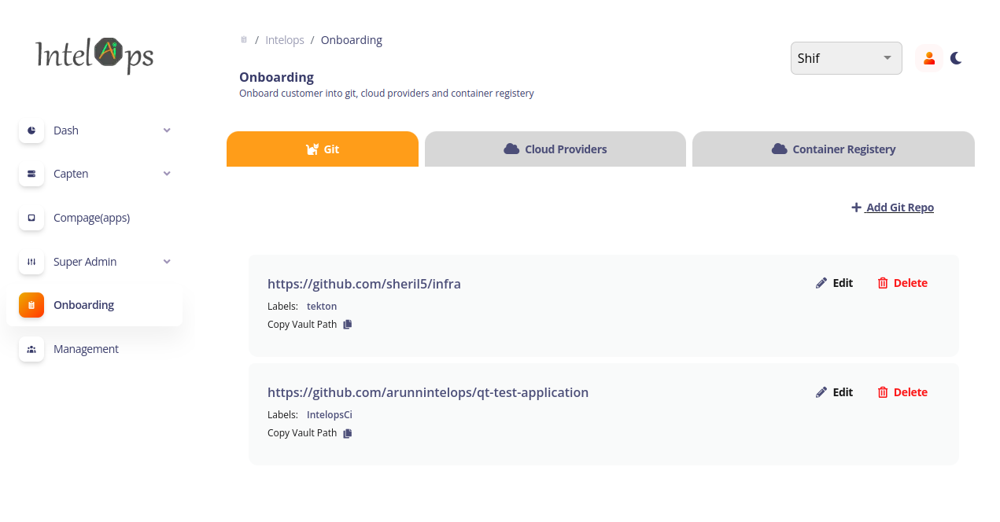
   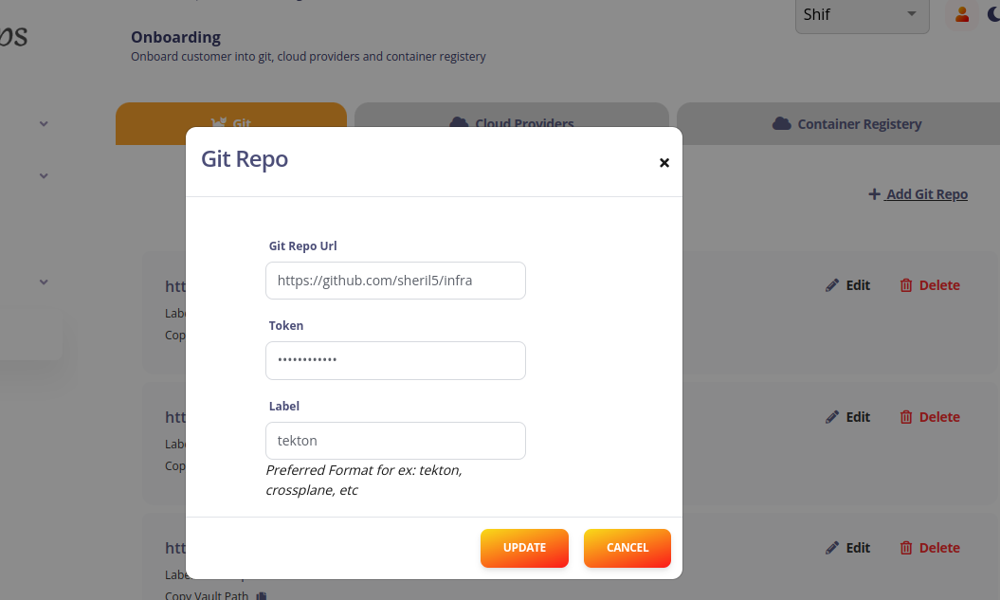

   * select the `add git repo` from the **git** section
   * add the git repo url,access token and label for the customer repo (label is tekton) and the tekton ci/cd repo (label is IntelopsCi)
3. Onboarding container registry in to capten

  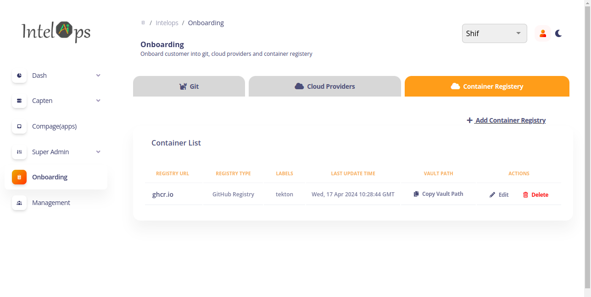
  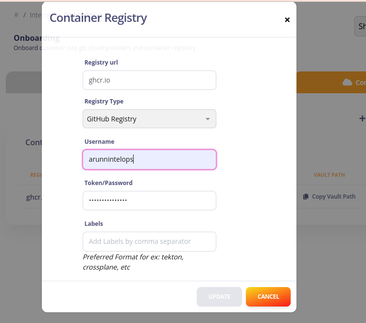  

   * select `add container registry` from **container registry** section
   * add  the registry url,username,access token and label to which the built image needs to be pushed (labels is "tekton")
# Configuring Tekton
## Configuring Capten Tekton Plugin 

   Go to the *capten-->platform engineering* ,select on the tekton plugin setup and then select the `sync` option under the  **configure** section and this will configure the tekton and the neccessary floders will be created in the customer's repo

   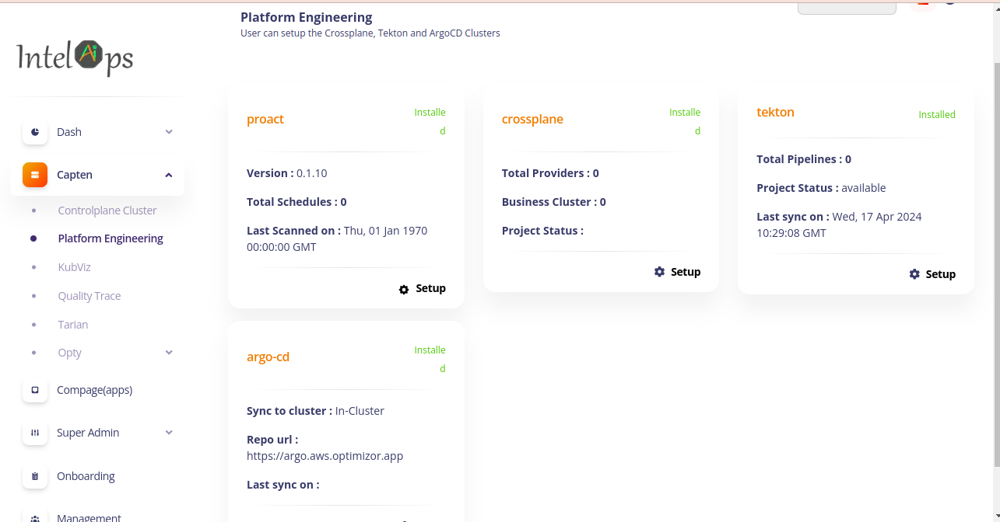

   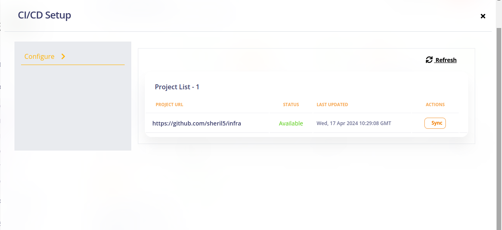

   
# Pre-requisite For Tekton CI/CD Pipeline Creation

* Use the already created **tekton-pipelines** namespace for the creation of pipeline.

* Create a secretstore from the yaml given below.Replace the server with the url which can be obtained from the **kubectl** command given below.

  ```bash
  kubectl get ingress -n capten
  ```
  
       apiVersion: external-secrets.io/v1beta1
       kind: SecretStore
       metadata:
         name: vault-root-store
       spec:
         provider:
           vault:
             server: <"replace with the ingress host obtained from above command">
             path: "secret"
             version: "v2"
             auth:
               tokenSecretRef:
                 name: "tekton-vault-token"
                 key: "token"
                 

Here, the **tekton-vault-token** is the secret created in tekton namespace to access the vault.Copy-paste the **tekton-vault-token** secret in the required namespace where the tekton pipeline will be present and then create the above secretstore.


* Git secret
 
  Go to *onboarding-->git* under the respective git project  the path of the vault where the credentials of git  stored can be viewed.copy the path and add it to the path in the external secret yaml as given below

 ## Note

  Annotate the external-secret to specify the domains for which Tekton can use the credentials.

  A credential annotation key must begin with tekton.dev/git- or tekton.dev/docker- and its value is the URL of the host for which  Tekton will be using  that credential.
    eg-tekton.dev/git-0: https://gitlab.com , tekton.dev/git-0: https://github.com , tekton.dev/docker-0: https://gcr.io

          apiVersion: external-secrets.io/v1beta1
          kind: ExternalSecret
          metadata:
            annotations:
              tekton.dev/git-0: "https://github.com"
            name: gitcred-external
            namespace: tekton-pipelines
          spec:
            refreshInterval: "10s"
            secretStoreRef:
              name: vault-root-store
              kind: SecretStore
            target:
              name: gitcred-capten-pipeline
            data:
            - secretKey: password
              remoteRef:
                key: <vault path cpoied from ui>
                property: accessToken
            - secretKey: username
              remoteRef:
                key: <vault path copied from ui>
                property: userID
             

* Container registry secret

   Go to *onboarding-->container registry* under the respective container registry, where the path of the vault where the credentials of container registry  stored can be viewed.copy the path and add it to the path in the external secret yaml as given below

         apiVersion: external-secrets.io/v1beta1
         kind: ExternalSecret
         metadata:
           annotations:
             tekton.dev/git-0: "https://github.com"
           name: docker-external
           namespace: tekton-pipelines
         spec:
           refreshInterval: "10s"
           secretStoreRef:
             name: vault-root-store
             kind: SecretStore
           target:
             name: docker-credentials-capten-pipeline
           data:
           - secretKey: config.json
             remoteRef:
               key: <vault path copied from ui>
               property: config.json

   

* Cosign docker login secret
   
  Go to *onboarding-->conatainer registry* under the respective container registry  where the path of the vault in which the credentials of container registry  stored can be viewed.copy the path and add it to the path in the external secret yaml as given below

      apiVersion: external-secrets.io/v1beta1
      kind: ExternalSecret
      metadata:
        annotations:
          tekton.dev/git-0: "https://github.com"
        name: cosign-docker-external
        namespace: tekton-pipelines
      spec:
        refreshInterval: "10s"
        secretStoreRef:
          name: vault-root-store
          kind: SecretStore
        target:
          name: cosign-docker-secret-capten-pipeline
        data:
        - secretKey: password
          remoteRef:
            key: <vault path copied from ui>
            property: password
        - secretKey: registry
          remoteRef:
            key: <vault path copied from ui>
            property: registry
        - secretKey: username
          remoteRef:
            key: <vault path copied from ui>
            property: username


* Argocd secret
   
  Use the below secret yaml  and replace the password with the encoded argocd password which can be obtained by using the **kubectl** command  and the server url is obtained from the capten ui under *capten-->platform-engineering* .Copy the repo url from the argocd setup ,encoded it and add it to the server url.Username is admin ,add the encoded username to the yaml given below
  
 ```bash     
  kubectl get secrets argocd-initial-admin-secret -n argo-cd
  ```    
      
      apiVersion: v1
      data:
        PASSWORD: <replace with encoded argocd secret>
        SERVER_URL: <repo url copied from ui>
        USERNAME: <encoded username>
      kind: Secret
      metadata:
        name: argocd-capten-pipeline
        namespace: tekton-pipelines
      type: Opaque

* cosign-keys

  Now the cosign keys secret is automatically created in tekton-pipelines namespace.
  
* Extra-config secret

  Go to *onboarding-->git* under the respective git project where  the path of the vault in which the credentials of git  stored can be viewed.copy the path and add it to the path in the external secret yaml as given below

      apiVersion: external-secrets.io/v1beta1
      kind: ExternalSecret
      metadata:
        annotations:
          tekton.dev/git-0: "https://github.com"
        name: extraconfig-external
        namespace: tekton-pipelines
      spec:
        refreshInterval: "10s"
        secretStoreRef:
          name: vault-root-store
          kind: SecretStore
        target:
          name: extraconfig-capten-pipeline
        data:
        - secretKey: GIT_TOKEN
          remoteRef:
            key: <vault path copied from ui>
            property: accessToken
        - secretKey: GIT_USER_NAME
          remoteRef:
            key: <vault path copied from ui>
            property: userID


# Prepare Pipeline Resources For The Tekton Pipeline

Now commit the required pipeline,rbac,triggers and ingress in the customer repo under the directory *cicd-->tekton-pipelines-->templates*.Now go to the **argocd ui** and sync the tekton-pipelines application manually.

 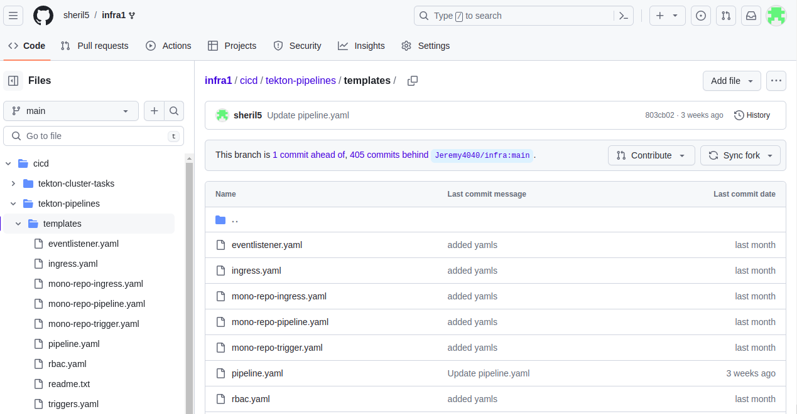

# QT in tekton

  1. create a new folder **qt_test** in the root directory

  2. place the test.yaml file which contains the testcases to test the deployed application inside the folder

  3. Note that the folder name should be **qt_test** and file name should be **test.yaml**.The sample testcase is given below,

     
         type: Test
         spec:
           id: zSn7HGzRR
           name: user service
           trigger:
             type: http
             httpRequest:
               method: GET
               url: http://10.244.0.15:80/api/UserService
           specs:
             - selector: span[tracetest.span.type="http" name="GET api/UserService"]
               assertions:
                 - attr:http.request.method = "GET"
                 - attr:http.route = "api/UserService"
                 - attr:name = "GET api/UserService"
                 - attr:tracetest.span.name = "GET api/UserService"
                 - attr:tracetest.span.type = "http"
                 - attr:url.path = "/api/UserService"
                 - attr:url.scheme = "http"
                 - attr:user_agent.original = "Go-http-client/1.1"
             - selector: span[tracetest.span.type="general" name="Tracetest trigger"]
               assertions:
                 - attr:tracetest.span.type = "general"
                 - attr:tracetest.span.name = "Tracetest trigger"

  4. Also ensure whether the  applicatin which is deployed in the business cluster is exposed

  5. Then add the url of the application in the test.yaml file

  6. After the execution of the pipeline we can check the qt task success and failure in the tekton-dashboard

  7. when the tekton pipeline fails due to quality-trace test case, it may be due to which assertions in the test yaml getting failed or configuration error between the test app and quality-trace. We can check the quality-trace server pod logs and quality-trace otel collector logs for errors and trace ids.If the test fails due to configuration errors, then in the quality-trace server log, it can be viewed as "Trace not found" error


* If all the assertions pass,below logs is shown

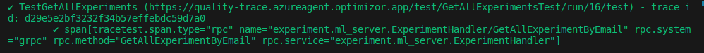

* If the assertion fails,below logs is shown

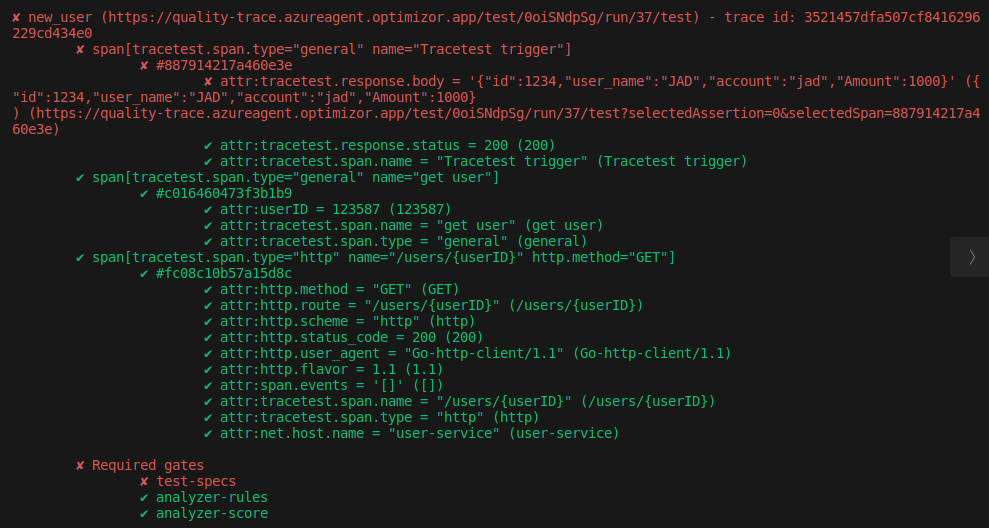


# Triggering Tekton Pipeline
 
1. Now add the **webhook url** to the tekton ci/cd repo and select the **event** on which the tekton pipeline needs to be executed upon trigger.

  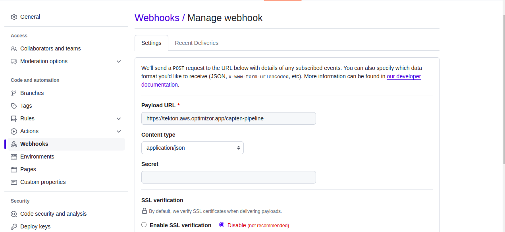

  2. If needed one can protect their branch using the branch protection rule which will be present under *settings-->branches-->add rule*

  3. In the add rule select the Require status checks to pass before merging and Require branches to be up to date before merging

  4. Then in the search box that appers under Require branches to be up to date before merging ,search for tekton-pipelines and add it,now whenever a pull_request is raised the check will run and once the checks is success the **merge** option will be visible

  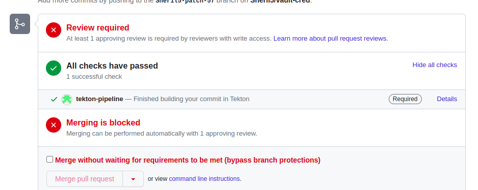

  5. once all the setup is done and now when a pull_request event is triggered (when a pull_request is raised), the tekton pipeline will get executed and the image gets built and pushed to the container registry ,the built image is then signed using cosign and finally once the application is deployed in the bussiness cluster the qt task in the pipeline will run the testcase to test the application and the success/failure task will get executed depending upon the result of pipeline.similarly the pipeline can trigger for event such as push,tag and release

  6. Also the success and failure status will be notified back to the git repo in the case of pull_request event.Note for this the branch protection rule needs to be added

  7. The tekton related pipelines and tasks can be viewed in the tekton-dashboard by clicking on the details option where the check is running or by clicking on the tekton icon present under Capten-->Controlplane Cluster in the ui

  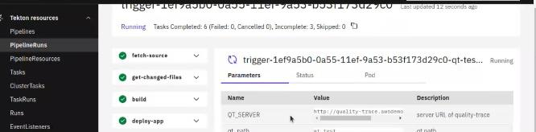

  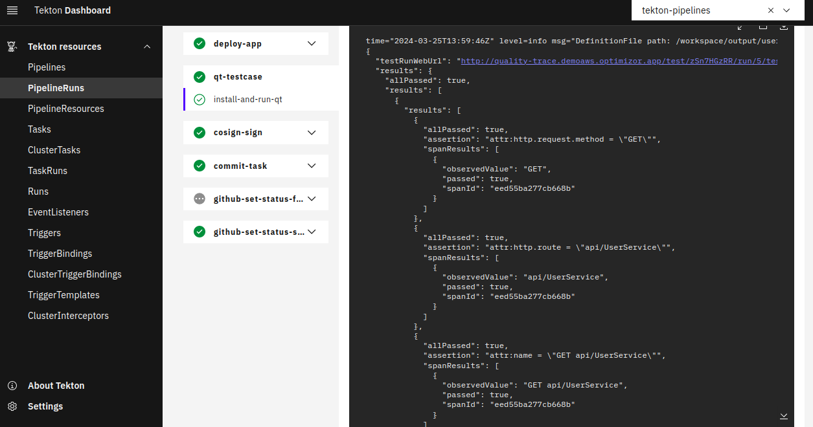
