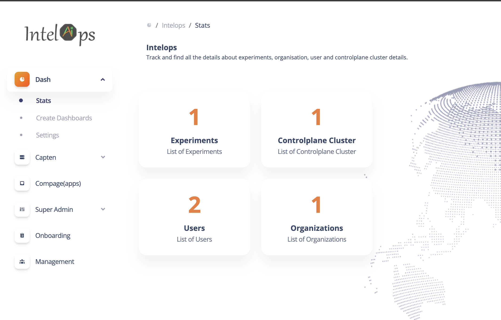
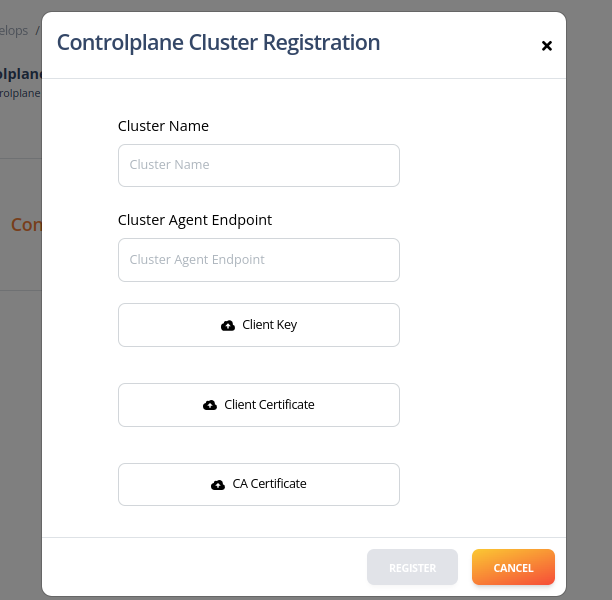
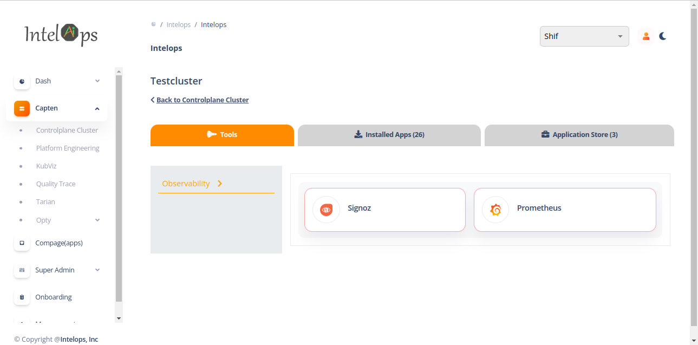
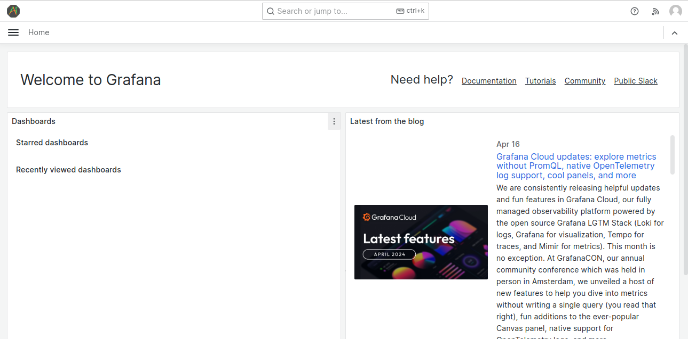
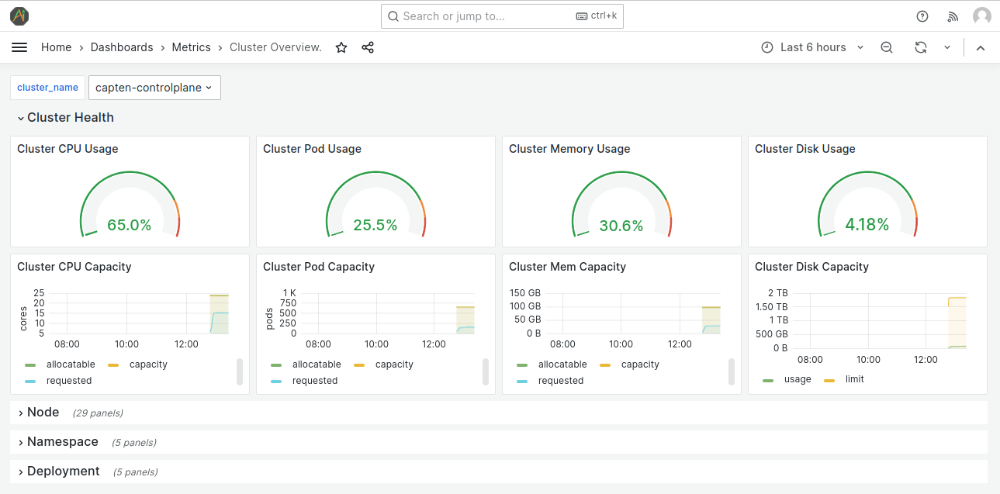
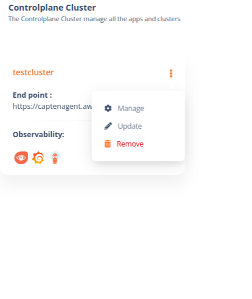

This document covers about how to access and register the control plane cluster in Capten UI.

# CAPTEN UI

### How to Access the UI?

1. For a new user, sign up on Intelops UI (https://alpha.intelops.app/)

2. For existing user, login with user credentials



3. After login to Intelops UI, for new user, popup screen will be displayed for creating organisation. Create organisation and assign the roles, add cluster admin role to register new cluster


### Registering Controlplane cluster



1. Provide the cluster name and upload the client certificates (./cert/capten-client-auth-certs.zip) created by Capten CLI.
2. Provide the cluster agent endpoint, Domainname configured in capten.yaml to be used for accessing the cluster


```bash
https://captenagent.<domainname>
```

For example agent endpoint, if 'aws.eg.com' Domainname is configure in capten.yaml,

```bash
https://captenagent.aws.eg.com
```

3. After providing above details, register the cluster.


### Capten Cluster Applications Management

Capten supports Web UI luanch for supportted applications, Web UI launch supported for default applications like grafana, signoz.

Navigate for Capten controlplane cluster by clicking on the Registered cluster.
Web UI launch applications listed on "Tools" tab




So once after logging in grafana via SSO,certain dashoards will be displayed



Launching the grafana Web UI and access grafana dashboards
Click on "Prometheus" Icon to launch grafana Web UI. Web UI will be launched with single sign-on and show grafana landing page, from there navigate to view dashboards

One of the cluster-overview metrics dashboards is as shown below



### DeRegistering the Controlplane cluster

Navigate for Capten controlplane cluster, Click the remove button to deregister the controlPlane cluster, it will delete registration data from Intelops cluster, to delete cluster, Capten CLI will have to be used.

